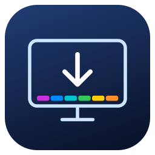
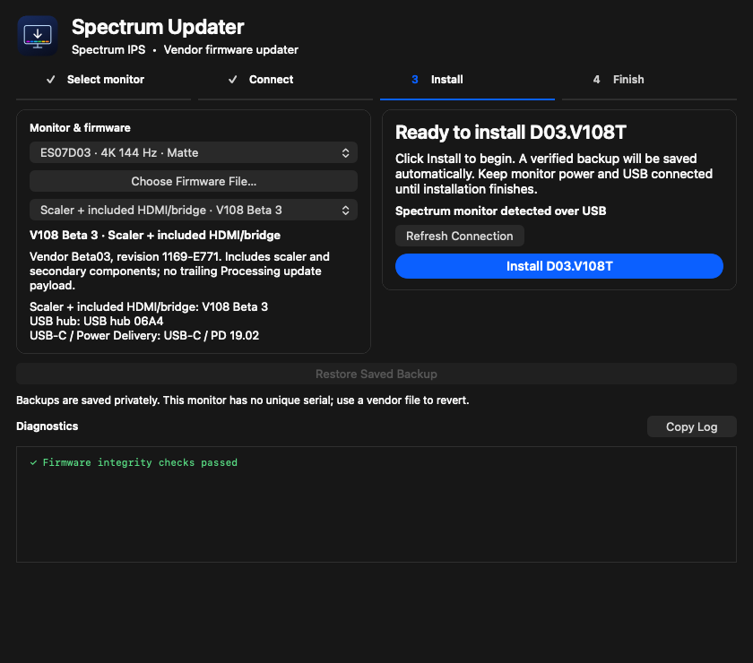
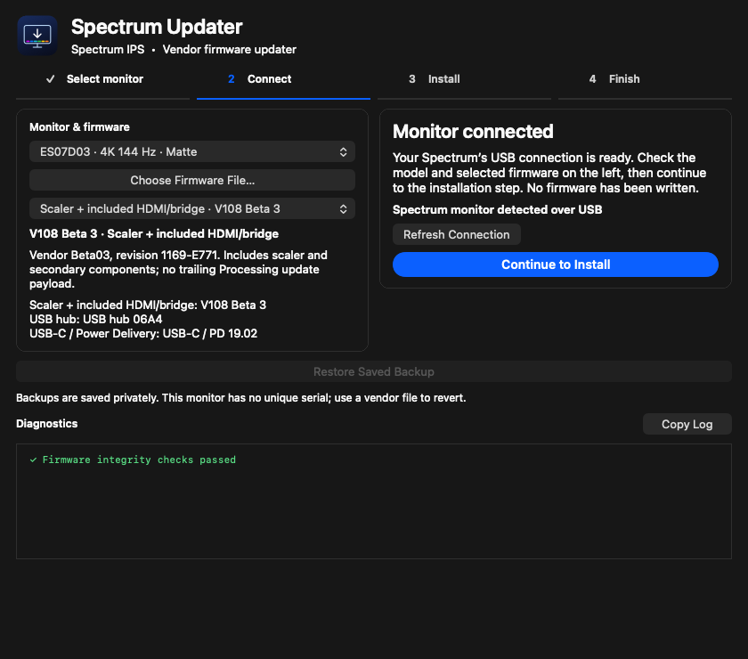

<div align="center">



# Spectrum Updater for macOS

**A native Mac workflow for stock firmware updates on supported Eve and Dough Spectrum IPS monitors.**

[Download](https://github.com/Golps/MacOS-Spectrum-Updater/releases/latest) · [Update guide](docs/UPDATE-GUIDE.md) · [Compatibility](docs/COMPATIBILITY.md) · [Troubleshooting](docs/TROUBLESHOOTING.md) · [UI gallery](docs/SCREENSHOTS.md) · [Contribute](CONTRIBUTING.md)


</div>



*Current UI rendered with simulated connection and update states. Screenshots illustrate the workflow; they are not evidence of a hardware update.*

## What it does

Spectrum Updater brings firmware selection, connection detection, backups, installation, readback verification, and diagnostics into one native macOS app. Import an original vendor package, select the model printed on your monitor, and follow the on-screen steps. No Windows virtual machine is required.

- **Stock scaler updates**, including the HDMI/bridge components contained in supported scaler packages.
- **Separate USB hub and USB-C Power Delivery routes**, using the shared VIA flash layout where compatible hardware is identified.
- **Original ZIP, BIN, and supported USB EXE imports.** Windows installers are unpacked as data and are never executed.
- **Automatic USB connection discovery.** The main screen identifies a Spectrum monitor rather than its internal USB Billboard Device.
- **Checks before writing:** exact release hashes, image integrity, compatible installed firmware, supported flash geometry, and component layout.
- **Durable backups before erase**, followed by readback verification of the written area.
- **One-page interface**, light/dark appearance, a single current-step indicator, and permanently visible diagnostics.
- **Readable logs:** success/error colors and text markers, no selected file paths, and no jumping to the bottom while you read older entries.
- **Universal app:** Apple Silicon and Intel, macOS 13 or later.

Firmware is **not bundled**. This repository distributes the updater and original source code, not Eve/Dough firmware binaries.

## Current validation status

**The ES07D03 scaler route has a reported successful physical update. USB hub/PD routes and updates on the other model units have not yet been physically validated.** Their protocol implementations and failure handling have passed offline simulations; macOS access to the paired hub and the actual device update behavior still need documented hardware results.

A supported profile means the software recognizes the specified model/release/controller combination. It does not mean every unit, factory firmware, flash chip, or recovery condition is covered. Unknown installed firmware and hardware are rejected before erase. See [validation and limitations](docs/VALIDATION.md).

This app installs unchanged vendor firmware. It does not claim to resolve blackouts, HDR/refresh-rate transitions, or wake delays through custom firmware changes.

## Supported IPS model profiles

| Model on the monitor label | Display | Accepted scaler releases |
| --- | --- | --- |
| **ES07D03** | 27-inch 4K 144 Hz, matte | V105, V106, V108, V108 Beta 3 |
| **ES07DC9** | 27-inch 4K 144 Hz, glossy | Glossy V101, shared V108 Beta 3 |
| **ES07E30** | 27-inch 4K 144 Hz, Gorilla Glass | V108, shared V108 Beta 3 |
| **ES07D02** | 27-inch QHD 280 Hz, matte | QHD V101, QHD Beta 1 |

Hub **06A4** and PD **0A.89.17.02 / 0A.89.19.02** are catalogued for these profiles, subject to the mandatory controller, installed-scaler, flash, and layout checks. Hardware testing for these routes is outstanding.

**Not supported:** ES07D01, ES07DCA, Spectrum Black OLED models, arbitrary or modified firmware, and unrecognized installed scaler releases. The QHD IPS model here is **280 Hz**; Spectrum Black 240 Hz models belong to a different OLED family. [Full compatibility matrix and source references →](docs/COMPATIBILITY.md)

## Download and open

1. Open [Releases](https://github.com/Golps/MacOS-Spectrum-Updater/releases/latest).
2. Download **Spectrum-Updater-1.0-macOS.zip** and extract it.
3. Move **Spectrum Updater.app** to Applications, if desired, and open it.
4. Obtain the original firmware package appropriate to your monitor. Use the [vendor links and supported file list](docs/FIRMWARE.md).
5. Follow the [step-by-step update guide](docs/UPDATE-GUIDE.md).

The published binary is **ad-hoc signed, not Apple-notarized**. macOS may ask you to approve it in System Settings → Privacy & Security → Open Anyway after an initial launch attempt. There is no need to disable system security globally. Alternatively, [build the app from source](docs/BUILDING.md).

## The four-step workflow

| Step | What you do | What the app does |
| --- | --- | --- |
| **1 · Select monitor** | Select the label model and import original vendor firmware. | Identifies the exact release and checks the imported image. |
| **2 · Connect** | Connect the USB upstream data cable, choose the connection if needed, then select **Continue to Install**. | Detects the connection and lets you review the selected model and file. |
| **3 · Install** | Review the confirmation and keep power/data connected. | Checks the installed profile, saves a verified backup, installs, and verifies the written bytes. |
| **4 · Finish** | Perform the requested DC power cycle; let any secondary update finish. | Explains restart and version checks; allows another loaded component to be selected. |

Only the current step has an accent-colored progress line. Completed steps retain neutral check marks. USB detection by itself does not authorize a write or uniquely determine the physical model.



For hub/PD updates, prefer a **direct USB-B data cable** and HDMI/DisplayPort for video. Disconnect downstream USB storage/accessories and power the Mac independently. Update one component at a time and complete its power cycle before starting the next.

## Which components does it update?

| Component | Route | Important detail |
| --- | --- | --- |
| Scaler | MStar ISP, supported FW2 image | Factory FW1 is preserved. Only known stock releases are accepted. |
| Included HDMI/bridge payloads | Inside the scaler package | The monitor applies included secondary updates after restart; there is no separate raw-HDMI file workflow. |
| USB hub | Native VIA vendor-control SPI | Requires a directly paired VL822Q7 controller and recognized shared-flash layout. |
| USB-C / PD | Native VIA vendor-control SPI | Writes the VL103 PD partition while preserving the hub and PD backup region. |

A smaller package such as Beta 3 does not erase the entire tail left by a larger package. Beta 3 also omits the trailing component that causes the on-screen `Processing update` stage. These are expected package differences, not proof of an incomplete update. [Technical details →](docs/ARCHITECTURE.md)

## Backups and verification

Backups are saved privately on the Mac before any erase. The app verifies backup integrity and keeps a receipt linking it to the selected connection and operation. Successful readback means the intended bytes were written; the monitor still needs to restart and apply any included secondary update.

Matching scaler backups can be offered for restoration when the monitor exposes a unique serial number. Many units expose a placeholder serial, so those device-specific restores are unavailable. USB whole-chip backups are retained for recovery/diagnosis but are **not** automatically restored by this app. Choose a compatible original component file to revert where the current layout can still be recognized. [Backup and recovery guide →](docs/RECOVERY.md)

## Building and testing

Apple Command Line Tools are required. The app uses native macOS frameworks and the system ZIP reader; no Homebrew packages are needed to run it.

```sh
git clone https://github.com/Golps/MacOS-Spectrum-Updater.git
cd MacOS-Spectrum-Updater
sh build.sh
```

The app is created at `build/Spectrum Updater.app`.

```sh
# No firmware downloads or monitor access:
sh test-catalog.sh
sh test-ui.sh

# Optional full offline protocol suite; downloads pinned vendor test fixtures:
python3 tools/fetch_test_fixtures.py
sh build.sh
sh test.sh
```

Tests use memory-only transports and offscreen views. They do not flash a connected monitor. Python 3.10+ is recommended for developer tools. [Build, tests, CI, and release packaging →](docs/BUILDING.md)

## Help improve Spectrum firmware

The project started with an interest in making the update process accessible on a Mac and understanding opportunities to improve the Spectrum experience. The hardware offers room for careful exploration of wake responsiveness, input transitions, link handling, and USB-C behavior.

We welcome **AI-assisted firmware research**, independent reverse engineering, better protocol documentation, test harnesses, and reproducible hardware findings. Bring your own AI tools, but pair proposed changes with traceable evidence, device compatibility checks, and a practical recovery plan. This public updater deliberately installs stock firmware; custom firmware research belongs in separately reviewed work until it is supported by adequate evidence.

Start with [the firmware research guide](docs/FIRMWARE-RESEARCH.md), open a [research proposal](https://github.com/Golps/MacOS-Spectrum-Updater/issues/new/choose), or read [CONTRIBUTING.md](CONTRIBUTING.md). Better results come from sharing reproducible measurements and explaining what changed, not just sharing a binary.

## Research references and acknowledgements

- [niklas389/dough-monitor-tools](https://github.com/niklas389/dough-monitor-tools): MStar ISP, flash/image analysis, and Spectrum-specific observations.
- [fwupd VIA plugin](https://github.com/fwupd/fwupd/tree/main/plugins/vli): VIA USB control protocol, VL822 headers, and VL103 shared-SPI layout references.
- [innoextract](https://github.com/dscharrer/innoextract): Inno installer stream-format references.
- [XZ format](https://tukaani.org/xz/xz-file-format.txt): framing used by the native exact-package importer.
- [Dough firmware announcement](https://www.reddit.com/r/doughcommunity/comments/15etlh9/firmware/) and [Spectrum One specifications](https://files.bbystatic.com/sZx8dgseD2pOvZWD8uQA0g==/Specifcations): vendor model and release references.

Protocol facts informed independent implementations in this repository. Referencing another project does not imply its endorsement or redistribution of its code. See [PROTOCOL.txt](PROTOCOL.txt) and [research references](docs/REFERENCES.md).

## Project map

```text
src/                    Native Swift UI, importer, backups, and C flash engines
tests/                  Offline protocol, image, importer, backup, and UI tests
tools/                  Fixture download, UI screenshots, and release packaging
docs/                   Update guides, compatibility, recovery, and research
docs/assets/            Logo and UI images
docs/validation/        Sanitized evidence from the packaged build
.github/                CI and issue templates
Info.plist              App metadata
build.sh                Universal macOS build
LICENSE                 MIT license for original source code
```

Independent community project. Not affiliated with or endorsed by Eve, Dough, VIA, or the referenced upstream projects. Original source is [MIT licensed](LICENSE); vendor firmware remains governed by its respective rights and terms.
