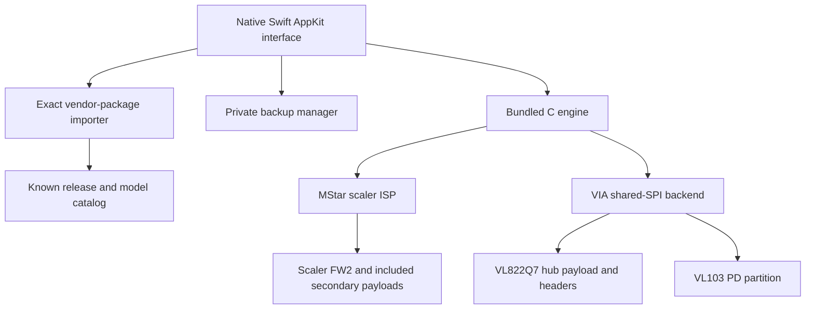

# Architecture and update routes

[← README](../README.md) · [Detailed implementation notes](../ARCHITECTURE.txt)

## Layers

## Interface and orchestration

`App.swift` manages selection, private import snapshots, registry-only discovery, confirmation, process output, and the four-step workflow. `GuidedUI.swift` is a pure presentation view that can be tested/rendered without device access. `UpdateLog.swift` buffers partial process lines and produces sanitized semantic events.

Periodic discovery doesn't redraw an unchanged connection. Presentation updates are idempotent. There is no outer page scroll view; only the diagnostics log scrolls. New log messages preserve the reader's scroll position unless they are already following the bottom.

## Importer and catalog

`FirmwareCatalog.swift` identifies exact firmware hashes and permitted models. `VendorImport.swift` recognizes pinned original ZIPs and USB installers. ZIP extraction uses the system reader with bounded output and a private snapshot. USB EXEs are never executed: pinned raw LZMA2 streams are framed as XZ for Apple's Compression decoder, then extracted payload hashes are checked.

The catalog isn't a generic “any BIN” input. Target authorization and installed-image compatibility are separate checks. Shared images establish compatibility, not an independently verified physical label.

## Scaler engine

`protocol.c` implements the MStar ISP sequence with strict transfer lengths and bounded setup handling. `image.c` validates image structure, outer/application CRC32, staged main-build CRC16, and component CRC16 values. `files.c` handles hashes and durable/exclusive backup files.

Supported scaler geometry is Macronix C22017/C22018, with a fixed FW2 update window at `0x400000–0x800000` on both chip sizes. Factory FW1 is preserved. Normal installs erase the rounded image span and verify that complete span; smaller images retain the flash tail beyond it. A scaler restore covers all FW2 from a validated backup.

Included secondary components travel as unchanged bytes in the stock scaler container. The monitor applies the relevant components after restart. This is why a scaler package can include an HDMI/bridge update without a standalone raw-HDMI backend.

## USB hub/PD engine

`vli.c` implements a separate vendor-control SPI protocol and pure flash planner. `vli-cli.c` adds model authorization, a read-only installed-scaler check, paired-hub opening, consistent shared-flash reads, backup receipt creation, programming, and final verification.

The selected `2109:8886` billboard must have the compatible immediate USB2 device ancestor `2109:2822`. `macos.c` uses normal IOKit access; no root helper, driver seizure, or kernel extension is added. A denied open stops the route rather than overriding the OS driver.

Runtime silicon and flash checks are mandatory. The planner requires valid factory hub and current PD metadata, bounded payloads, and consistent linked headers. It rejects unknown/ambiguous layouts and protected SPI configurations.

| Shared-flash region | Role |
| --- | --- |
| `0x0000` | Factory/root hub header |
| `0x1000` | Update hub header |
| `0x1800` | Factory-header recovery copy |
| `0x2000` | Factory hub payload; updated payload is placed after its rounded span |
| `0x20000–0x28000` | Active PD partition |
| `0x30000` | Retained PD backup region |

A hub update preserves factory payload and PD partitions, writes payload data first and the entry chunk last, then commits update/root-link headers. A PD update changes only its permitted partition and preserves adjacent hub/backup data. Before each erase, the sector is rechecked against the saved snapshot; programming/readback is bounded and final verification compares the complete SPI plan.

The component planner also rejects handcrafted plans that change forbidden bytes. No whole-chip erase or implicit SPI protection removal is implemented.

## Operations and backups

One shared lock covers app/CLI hardware operations. Host idle sleep is inhibited during maintenance. Signal guarding reduces ordinary process interruption but cannot protect against power loss, forced termination, a host crash, or an unplugged cable.

Backup files are exclusively created, verified through their open inode, and durably synced with receipts before any erase. GUI restore eligibility additionally depends on integrity metadata and a unique device serial. Scaler and USB backups are separate; raw USB whole-chip restore is not exposed.

## Validation boundary

The tests demonstrate implementation behavior against image fixtures, memory-only USB/SPI models, injected failures, and offscreen UI states. They do not certify macOS hub-driver coexistence, physical controller behavior, model-specific secondary update behavior, or power-loss fallback. [Evidence and outstanding validation →](VALIDATION.md)
