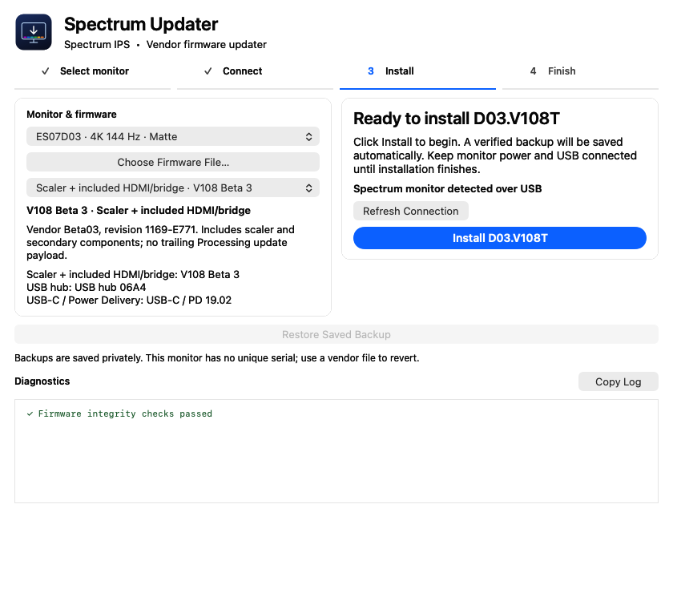

# Interface gallery

[← README](../README.md)

These are offscreen renders of the current native AppKit presentation views with simulated monitor and progress data. They show the interface, not physical device validation. Regenerate them with `tools/render_docs.swift` as described in [Building](BUILDING.md).

## Select monitor

## Connect and review

## Ready to install

## Programming progress

## Finish and power cycle

## Light appearance

The whole workflow fits on one page. Diagnostics remain visible and scroll internally; only the current step is accented. A real app session reflects its actual imported firmware, connection, and operation result.
