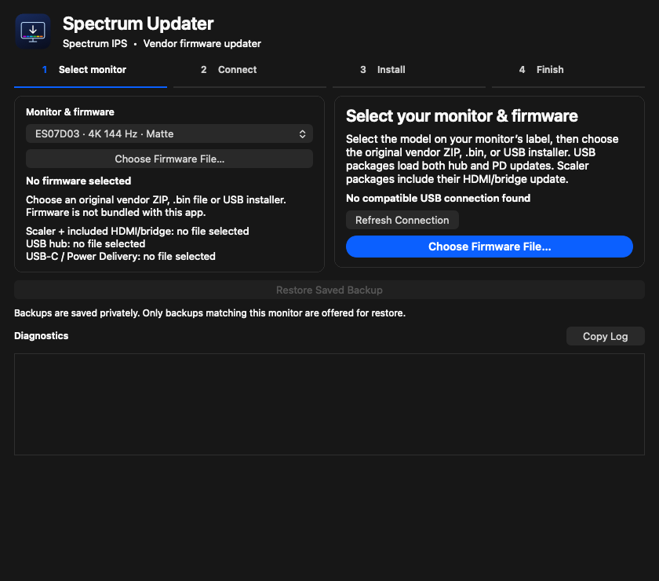
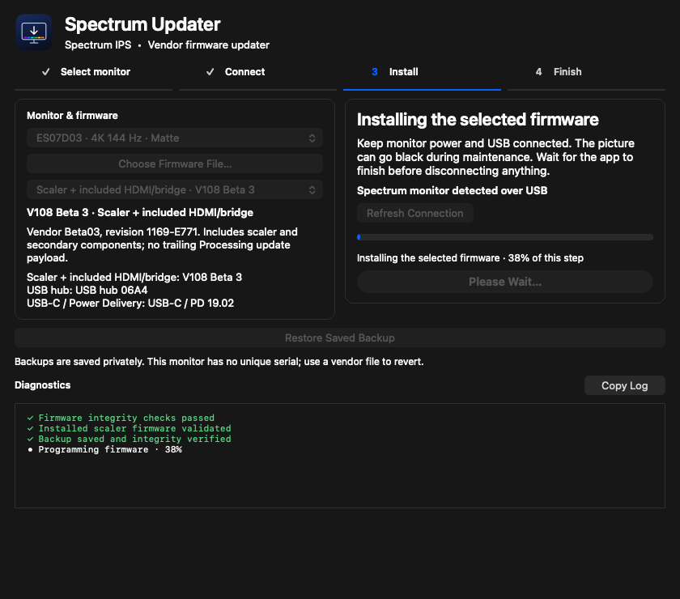
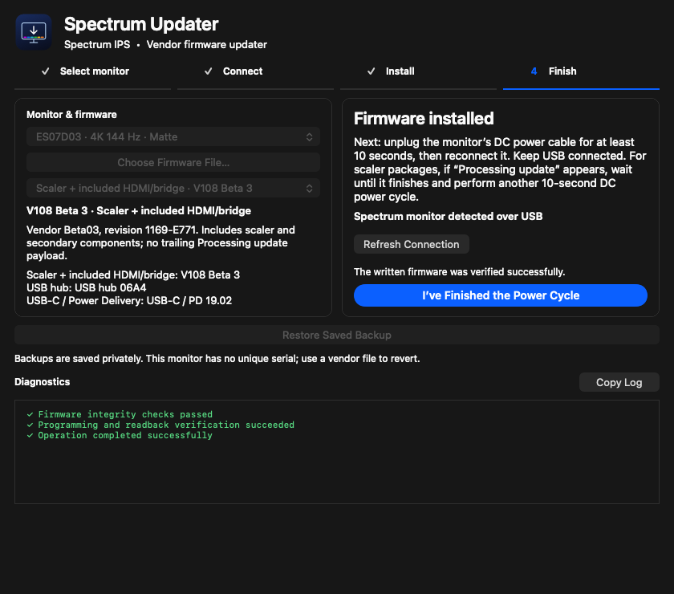

# Updating a Spectrum from macOS

[← README](../README.md) · [Compatibility](COMPATIBILITY.md) · [Troubleshooting](TROUBLESHOOTING.md)

This guide covers the **stock updater**, version 1.0, build 15. It does not describe installing custom firmware. The ES07D03 scaler route has a reported successful hardware update; hub/PD and the other model units still need physical validation.

## Before you begin

- A Mac running **macOS 13 or later**, Apple Silicon or Intel.
- A model listed in [Compatibility](COMPATIBILITY.md). Read the model on the physical monitor label; the USB product name is not its model.
- A known original vendor firmware package. A file with a familiar filename is not enough: the app accepts its exact bytes/hash.
- Stable monitor power and Mac power. For hub/PD, power the Mac independently of the monitor's PD port.
- A direct USB upstream **data** connection. A video-only HDMI/DisplayPort cable cannot carry the updater's USB commands.
- Time to leave the operation uninterrupted and complete the power-cycle instructions.

For hub/PD, prefer USB-B for data and HDMI/DisplayPort for video, and disconnect USB storage and accessories downstream of the monitor. Keep the monitor's DC power connected throughout writing.

## 1. Download and open the app

Download the app ZIP from [GitHub Releases](https://github.com/Golps/MacOS-Spectrum-Updater/releases/latest), extract it, and open `Spectrum Updater.app`. Moving it into Applications is optional.

The binary is ad-hoc signed and is not notarized by Apple. If macOS prevents opening it, first try to open it normally, then check System Settings → Privacy & Security for **Open Anyway**. The exact prompt depends on the macOS version and quarantine state. Building from source is another option.

The source-code ZIP on a GitHub release is not the app download. Choose the separately attached `Spectrum-Updater-1.0-macOS.zip` asset.

## 2. Select the monitor model and firmware

At startup, **Select monitor** is the only highlighted step.

1. Select the model printed on your monitor label.
2. Click **Choose Firmware File…**.
3. Select an original supported vendor ZIP, `.bin`, or USB installer `.exe`.
4. Check the recognized version and component shown in the app.

ZIPs are unpacked automatically. Supported USB installers are parsed as data, never executed, and load both the USB hub and PD files. The app stores private temporary snapshots of imported firmware and checks them before use. Normal app termination removes those snapshots.

Importing a second component keeps the previously loaded components. A new file for the same component replaces that component's selection. When multiple components are loaded, choose the desired component from the firmware menu.

The app includes no firmware binaries and does not download them automatically. [Supported releases and vendor links →](FIRMWARE.md)

## 3. Connect and review

Connect the monitor's USB upstream data cable directly to the Mac. In the monitor's OSD, set **Select USB hub source** to the upstream Type-B or Type-C connection being used.

Detection is automatic. The display connection appears as **Spectrum monitor**, even if macOS calls the internal device **USB Billboard Device**. If more than one connection is detected, select the intended one, or temporarily connect only the monitor being updated.

With compatible imported firmware, the indicator moves to **Connect**. Once the connection is detected, review the model and component on the left and click **Continue to Install**. This advances to **Install**; it does not flash firmware.

USB discovery reads the macOS registry. It does not enter ISP mode or read/modify flash. The installed scaler profile is checked later when you start the update. Detection by itself does not prove that the selected physical model is correct.

## 4. Start installation

Click **Install** for the selected component and read the confirmation. The dialog names the chosen firmware and explains power/connection requirements.

After confirmation, the engine:

1. Acquires the shared operation lock and holds a macOS idle-sleep assertion.
2. Checks the selected model against recognized installed scaler firmware.
3. Identifies supported flash/controller geometry and, for hub/PD, the directly paired USB controller and shared-flash layout.
4. Reads the required flash contents twice and checks that they match.
5. Creates an exclusive, durable backup and receipt and verifies the backup.
6. Erases only the permitted region/sectors, programs the component, and performs readback verification.
7. Ends the hardware session and tells you what to do next.

An unknown image, incompatible profile, unsupported chip/layout, protected SPI status, failed transfer, or failed backup check stops the operation. Rejected pre-write checks do not justify bypassing the model or geometry restrictions.

## 5. Read progress and diagnostics

The app reports operations such as reading, erasing, programming, and verifying. Percentages apply to the **current operation phase**, so a new phase starts its own progress range.

Diagnostics stay visible. Green checks indicate successful checks/results; red crosses indicate errors. Text markers preserve meaning without relying on color alone. File paths and raw command arguments are omitted from the visible log.

If you scroll up, new messages preserve your position. When you are already at the bottom, the log follows new messages. **Copy Log** copies the visible sanitized diagnostics. Review any diagnostic text before sharing it publicly.

Do not disconnect monitor DC power or USB during writing. The screen may go black during maintenance, and USB devices connected through the monitor may be unavailable. Let the app finish; the sleep assertion does not protect against an unplugged cable, a crash, or a forced shutdown.

## 6. Complete the power cycle

When instructed:

1. Unplug the monitor's **DC power cable** for at least **10 seconds**.
2. Reconnect power and allow the monitor to restart.
3. Keep USB connected.
4. If `Processing update` appears, let it finish, then perform another 10-second DC power cycle.
5. Click **I've Finished the Power Cycle** when you have completed the instructions.

The monitor's front power button is not a substitute for the instructed DC power cycle.

Some supported scaler packages contain trailing secondary components that produce `Processing update`; **V108 Beta 3 does not contain the trailing component**, so that stage is absent. The absence is expected for Beta 3.

## 7. Check the result

A successful app result confirms programming/readback, not that the monitor has finished booting the new firmware. Check the scaler version in the monitor's information screen after restart. USB firmware versions may be displayed separately, depending on its OSD firmware.

The app's optional **Compare Installed Firmware** command reads and compares the selected component. It enters maintenance; follow any cleanup/power-cycle instructions after comparison. It is not just an OSD lookup.

Test normal display, wake, input switching, and USB behavior for your own use. This app installs stock firmware and makes no promise that any particular vendor release fixes a symptom.

## 8. Update another component, if needed

Choose another loaded component from the firmware menu, review Connect again, continue to Install, and repeat. Use the latest appropriate scaler package first, then hub, then PD where those updates are needed and the hardware checks allow them.

Do not start another component until the preceding component's power cycle is complete. The app does not perform one unattended update of all components, and it checks for already-matching firmware rather than rewriting it unnecessarily.

## If the operation stops

Keep the complete result and identify whether it stopped **before** or **after** erase/programming began. Follow the app's cleanup and power-cycle instructions. Read [Troubleshooting](TROUBLESHOOTING.md) and [Recovery](RECOVERY.md) before retrying. Do not substitute another model's firmware or bypass an unsupported-chip error.

*All UI images on this page are offscreen renders of the real presentation code using simulated data.*
